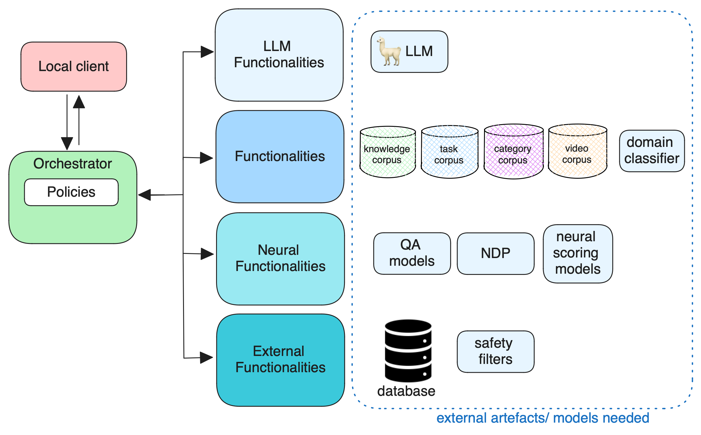

# Open Assistant Toolkit [OAT]: A research Platform for Multi-Modal Task Oriented Agents

We present OAT, a task oriented agent capable of guiding users through complex tasks. OAT is modular and extensible, enabling complex stateful behaviour for human-like long form interaction.

In the following README you'll find more information on how the Open Assistant Toolkit works, how to run and deploy it, and how to extend or customise its components to enable your own research into task oriented agents.

For additional details, [our paper](https://assets.amazon.science/f3/75/cbd31079434eaf0c171a1ae0c8a8/grill-tb2-final-2023.pdf) provides a nice overview.

## 🎬 Installation

OAT runs as a collection of Docker services, managed through Docker Compose. You will need to install both of these packages before using the system. The installation process will depend to some extent on your operating system, so refer to the [Docker documentation](https://docs.docker.com/get-docker/) for the recommended procedure. 

Once you have a working Docker and Compose installation, follow the steps below:

```sh
# clone the OAT repository
git clone https://github.com/grill-lab/OAT.git
cd OAT

# build the oat_common image used as a base by several other services
# (this has to be done manually due to docker compose limitations)
docker compose build oat_common

# build the set of "online" services, the ones that are required to form a functional instance of OAT
docker compose build
```

When the build process has completed, you can then launch a local instance of OAT. 

The first time you run OAT, various data files and other artefacts required by the system will be downloaded from an S3 bucket. These files only need to be downloaded once, but you can choose to download them in 2 ways: 
 1. Have the docker services download the files as they start up
 2. Pre-download everything and then start the system. 

The latter option may make it easier to keep track of download progress and any errors that might occur:

```sh
# Option 1: bring up the online services, downloading files as needed
docker compose up

# Option 2: download all the files first and then start the services
docker compose run downloader functionalities neural_functionalities llm_functionalities
docker compose up
```

On a first run, some of the services may not finish loading immediately, especially if they have to download files. Look for "Finished loading all models" messages in the Docker log output from each service to indicate they are ready to be used. On subsequent runs of the system the services will become ready to use much more quickly as the required files will already exist locally. You can check the logs for the "Finished loading" messages like this:

```sh
docker compose logs | grep "Finished loading"
```
which should show one line for each service that has finished loading, e.g.:
```
functionalities           | [2023-12-15 13:06:24,921] - INFO - local.functionalities - main.py.serve:90 - Finished loading all models
neural_functionalities    | [2023-12-15 13:12:55,994] - INFO - local.neural_functionalities - main.py.serve:75 - Finished loading all models
```

All downloaded files will be stored in Docker volumes mapped to the `OAT/shared/file_system` path, and they won't be downloaded again unless you remove the local copies. You may need **50GB** or more free disk space to accommodate all the data and models required by OAT.

Once all services have started successfully, you should be able to view the `local_client` interface by browsing to http://localhost:9000. The local client allows you to interact with OAT using text or by clicking on the image and button elements on the right hand side of the screen.

--- 

**Note**: you may find that the `llm_functionalities` service fails to start if a suitable GPU is not detected. The system is designed to operate without this service if necessary. 

## ▶️ Deploying OAT

#### Option 1: Deploy and run locally
The simplest option to run OAT is to run it locally with `docker compose` as described above. The service configuration is defined in the `docker-compose.yml` file in the root of the repository. 

#### Option 2: Deploy and run locally with minikube

Instructions for deploying OAT using [minikube](https://minikube.sigs.k8s.io/docs/) can be found [here](kubernetes/README.md). Note that this hasn't been tested recently.

#### Option 3: Deploying on GCP

There are scripts for deploying an instance of OAT to a GCP under `OAT/cloud/gcp/`. (TODO: these will need tested and updated)

## 👀 How do I view logs?
Logs can be seen from the  docker command line or from a file located at `shared/logs/db.log`. You should see logging output from the `docker compose up` command, or you can use the following command to see the latest updates live:
```
$ tail -f shared/logs/db.logs
```

## Other OAT services

OAT includes various other services that aren't part of the online system. Images for these service won't be built by running `docker compose build`. To use each of these services, you first build the image and then run it through `docker compose`. The services and their purposes are described below.

### Offline pipeline

One of the important new features in this release of OAT is the offline pipeline, which contains the code to generate the artefacts needed by the online system. The pipeline is described in detail in [its README file](offline/README.md). To build and run the pipeline:
```sh
# only needed once, unless you edit the Dockerfile
docker compose build offline
# run the pipeline as defined in offline/config.py
docker compose run offline
```

### Dashboard

OAT includes a custom [dashboard application](dashboard/README.md) that can be used to review session and conversation information. To build and start the dashboard:
```sh
docker compose build dashboard
docker compose up dashboard
```
Once running, you can access the dashboard at http://localhost:7500

### Tests

A set of unit and integration tests are included with the system (although not all are currently passing). The tests can be run through another Compose service named `tester` which is effectively a wrapper around [pytest](https://docs.pytest.org/en/7.4.x/). See the [README](tester/README.md) for more details.
```sh
docker compose build tester

# can now run the service as if it was a pytest executable

# run default set of tests
docker compose run tester

# run only a subset of tests
docker compose run tester -k test_download
```

### Training

OAT's Neural Decision Parser model can be retrained using this service:
```sh
docker compose build training
docker compose run training
```
See the [README](training/README.md) for more information. 

### Downloader

OAT includes some file downloading functionality used by services to acquire artefacts that they require to operate from remote locations. The downloads required by each service are defined in `downloads.toml` files in their respective directories, e.g. `functionalities/downloads.toml`. Normally each service will retrieve these artefacts when first launched, but if you want to ensure everything is downloaded before the system is brought up, you can do it using this service. It will download all artefacts for one or more services and then exit.
```sh
docker compose build downloader
# run with one or more service names as parameters
docker compose run downloader functionalities llm_functionalities
```

For more information on this feature, see [this README](doc/README-downloads.md).

## ℹ️ Release History
+ v2.0.0: December 15, 2023: Major update based on [GRILLBot-v2](https://assets.amazon.science/f3/75/cbd31079434eaf0c171a1ae0c8a8/grill-tb2-final-2023.pdf).
+ v0.1.1: Apr 30, 2023: Update for [CIS Tutorial @ The Web Conf 2023](https://cis-tutorial.github.io/#presentation-slides)
+ v0.1.0: July 11, 2022: initial release for [SIGIR'22 tutorial](https://github.com/grill-lab/CIS-Tutorial-SIGIR2022)

## 📃 Additional documentation


At it's core, policies encapsulate the behaviour of OAT.


OAT consists of multiple containers, encapsulating different system functionalities.
Containers include the local client, orchestrator, and four different functionality containers:
- [Local client](./local_client/README.md)
- [Orchestrator](./orchestrator/README.md)
- [LLM functionalities](./llm_functionalities/README.md)
- [Functionalities](./functionalities/README.md)
- [Neural Functionalities](./neural_functionalities/README.md)
- [External Functionalities](./external_functionalities/README.md)


The different containers and their required artefacts and models. They are pulled upon spinning up the containers.

## ✨ References

If you use OAT, please cite the following paper: 

```
@INPROCEEDINGS{}
```
