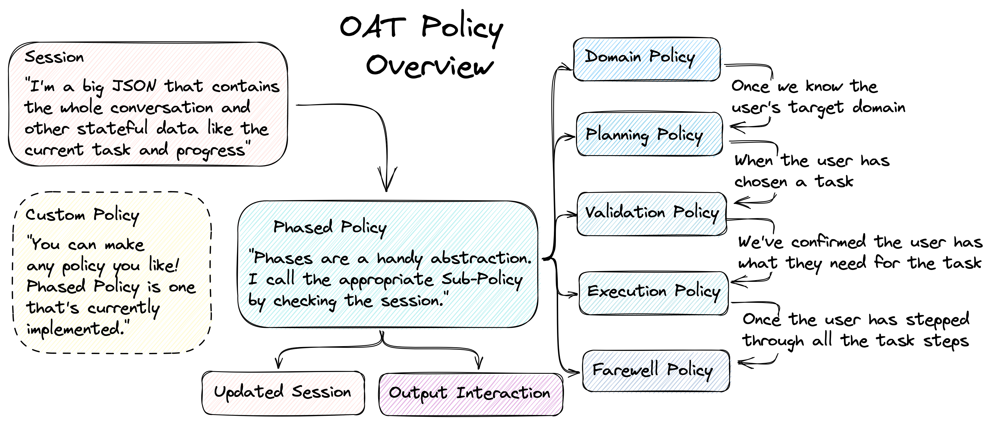
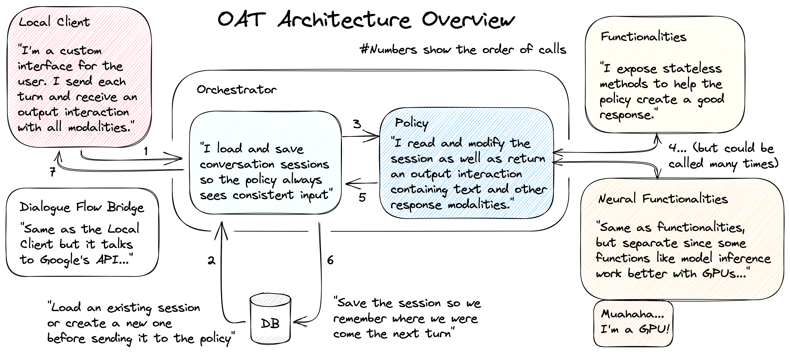

# Open Assistant Toolkit [OAT]: A research Platform for Multi-Modal Task Oriented Agents
We present OAT as a task oriented agent capable of guiding users through complex tasks. OAT is modular and extensible enabling complex stateful behaviour for human-like long form interaction.

In the following README you'll find more of how the Open Assistant Toolkit works, how to run it, deploy it, and extend various components to enable your own research into task oriented agens.



At it's core, policies encapsulate the behaviour of OAT.


## Using Docker

Docker allows you to run the entire application by only installing the single docker dependency.
The docker environment is an Ubuntu instance which runs both the client and server. 

There are multiple services defined to run the application:
- `local_client`: A custom built client emulating the developer console.
- `dashboard`: 
- `taskmap_generation`: 

To run these systems we use **docker compose** which spins up and connects all the services together through environment variables. They are defined in `docker-compose.ylm`. To run use:
```
$ docker-compose up --build
```
Then open a browser and load http://127.0.0.1:9000

#### Viewing logs
Logs can be seen from the  docker command line or from a file located at `shares/logs/db.log`.
You can use the following command to see the latest updates live:
```
$ tail -f shared/logs/db.logs
```

# Running with kubernetes
## Local development with minikube
Minikube is a service that provides a virtual cloud to emulate a production environment. See here: https://minikube.sigs.k8s.io/docs/

**Terminal1**
You will need several terminal windows, each snippet corresponding to a window.
```
cd OAT/
minikube start
minikube tunnel &
minikube dashboard &
minikube mount ./shared:/shared 
```

**Terminal1**
Building the images and running them can be done with the following script. This does the following:
- Runs bob the builder to generate the protobuf python files in shared.
- Changes the docker env to be visible to minikube. This is distinct from the host docker env. This can be done manually by running: `eval $(minikube docker-env)`
- Builds all the images  from the dockerfiles
- Deletes all pods relating to OAT by running: `kubectl delete -k ./`
- Applies the manifests to minikube by running: `kubectl delete -k ./`
```
cd OAT/kubernetes
bash build_and_run.sh
```

You should then see the enpoint be available at `localhost:9000`


## Restarting with only modified code
If the pods in kubernetes are already running and you only need to reload new code you can use the following command to reload the images. Note, this **does not build the images**, it only reloads the pods to pull their latest version. It can be faster, maybe just useful to know.
```
kubectl rollout restart -f ./
```

## Kustomization and kubectl
`kubectl` is  the primary way to interface with kubernetes through the commandline. When using the `-k` option we are specifying to kubectl to read the `kustomization.yaml` in a particular directory.
Kustomize is a tool we use to modify config. Check out more here: https://kubectl.docs.kubernetes.io/guides/introduction/kustomize/

We use kustomize to aggregate all kubernetes manifests into a single output  and  specify what resources need to be spun up. Since `OAT` has certain  components  that are only required when running it standalone, they are specified as extras in `/kubernetes/internal_overlay`. If you notice, the `kubernetes/kustomization.yaml` specifies `internal_overlay` as a resource so by running `kubectl apply -k  ./` we will run `OAT` with the resources to  run it as standalone such as: external functionalities, and a dynamodb docker.

To  gain  a more intuitive understanding of what kustomization is doing, see what it does by running `kubectl kustomize ./kubernetes` and see the full manifest that is passed to `kubectl`.

## Full Run Locally
Here are instructions for a completely fresh ubuntu system.
```
$ sudo apt-get update
$ sudo apt-get install docker.io
$ sudo curl -L "https://github.com/docker/compose/releases/download/1.29.2/docker-compose-$(uname -s)-$(uname -m)" -o /usr/local/bin/docker-compose
$ sudo chmod +x /usr/local/bin/docker-compose
$ sudo apt-get install awscli

```
