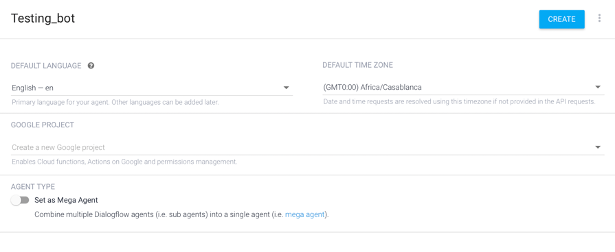
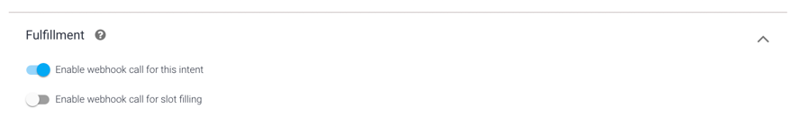
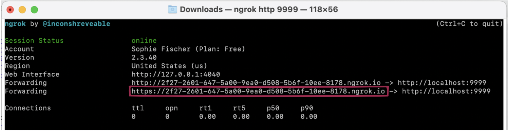

# Build the new dialogflow_bridge

- Make a new folder containing your DialogFlow connector
- The folder will contain the following files:
  - `Dockerfile`

    ```dockerfile
    FROM python:slim

    ARG DISTRIBUTOR_URL
    ENV DISTRIBUTOR_URL ${DISTRIBUTOR_URL}

    RUN pip3 install awscli
    RUN aws configure set region us-east-1
    RUN pip3 install flask==2.0.1 requests==2.25.1 watchtower

    COPY dialogflow_bridge/ /source
    COPY shared/ /shared
    WORKDIR source

    CMD PYTHONPATH=/shared python main.py
    ```

  - `main.py`

    ```python
    import os
    from flask import Flask, request
    import requests

    app = Flask(__name__)


    @app.route('/', methods=['POST', 'GET'])
    def introducer():

        dialogflow_request = request.json
        user_utterance = dialogflow_request['queryResult']['queryText']

        request_obj = {
            'id': 'I like bananas',
            'text': user_utterance,
            'headless': True
        }

        middleware_endpoint = os.environ['DISTRIBUTOR_URL']+'/run'
        orchestrator_response = requests.post(middleware_endpoint, json=request_obj)

        response = {
            'fulfillmentText': orchestrator_response.json().get('speechText')
        }
        return response


    if __name__ == "__main__":
        app.run(host='0.0.0.0', port=8000, debug=True)
    ```

- Update Docker Compose to run the new Bridge Container
  ```yaml
  dialogflow_bridge:
  container_name: df_bridge
  build:
    context: ./
    dockerfile: dialogflow_bridge/Dockerfile
  volumes:
    - ./dialogflow_bridge:/source
    - ./shared:/shared
  ports:
    - "9999:8000"
  environment:
    - CONTAINER_NAME=dialogflow_bridge
    - DISTRIBUTOR_URL=http://orchestrator:8000
  networks:
    - internal
    - external
  depends_on:
    - orchestrator
  ```
- Run `docker compose up --build` to run the system
- In another terminal, run `ngrok http 9999` to create a https port

# Create an Agent on Dialogflow

- Go to https://dialogflow.cloud.google.com/
- Create a new Agent:

- Delete the Default Welcome Intent
- Select the Default Fallback Intent
- Scroll down to Fulfillment and enable WebHook call for this intent

- Go to fulfillment on the side-menu and enable webhook
  - Use the ngrok https url to set the webhook


# Logging

If you are interested in including logging to your DialogFlow module, make sure to use the logger instance from the `utils` module, which is configured to publish the logs to all the right places.

```python
from utils import logger

logger.info('This is a logging message')
```
