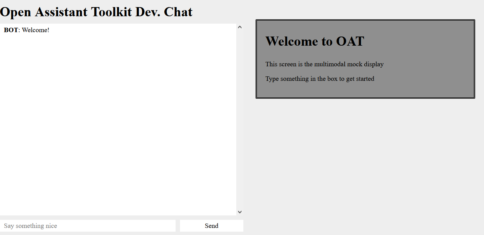
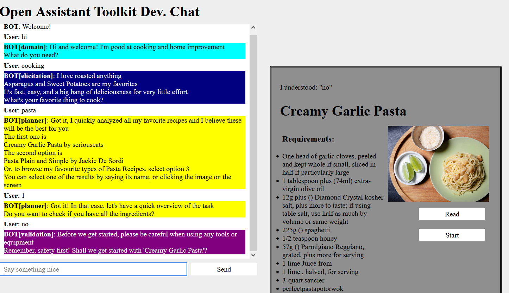

# Building and deploying OAT for the first time

## Introduction

This document aims to provide new users with a detailed walkthrough of the steps required to download, build, and run OAT. 

The instructions assume that Linux is being used as the host operating system, but OAT can be built and deployed using Docker installed on Windows or MacOS with an almost identical set of commands.

## Prerequisites 

1. Check you have at least 40-50GB of free disk space. On Linux you can do this from the terminal by running `df -hT`. This space is required both to build and store the OAT Docker images and to accommodate data files downloaded by OAT services when they are launched for the first time.
2. Install Docker. On Linux you only need to install [Docker Engine](https://docs.docker.com/engine/install/), but you can install [Docker Desktop](https://docs.docker.com/desktop/) instead if you prefer or are working on Windows/MacOS.
3. Install Docker Compose. If you have installed Docker Desktop, Compose should be included. If you've installed Docker Engine, you will probably need to [install Compose separately](https://docs.docker.com/compose/install/linux/).
4. Check that you can run `docker version` and `docker compose version` successfully to verify that both Docker and Docker Compose are working.
5. OAT requires a GPU for some of its functionality. An NVIDIA GPU is strongly recommended. You will need to install [the NVIDIA driver](https://docs.nvidia.com/datacenter/cloud-native/container-toolkit/latest/install-guide.html) and [the NVIDIA container toolkit](https://docs.nvidia.com/datacenter/cloud-native/container-toolkit/latest/install-guide.html), which allows Docker containers access to GPUs on the host system. 
6. Test your configuration by following the instructions under "Running a Sample Workload with Docker" on [this page](https://docs.nvidia.com/datacenter/cloud-native/container-toolkit/latest/sample-workload.html). If your system is configured correctly you should see the `nvidia-smi` output listing your GPU device.

## Part 1: Building OAT

Start by cloning a copy of the OAT repository from https://github.com/grill-lab/OAT/:

```sh
git clone https://github.com/grill-lab/OAT
cd OAT
```

(If you don't have `git` installed, you can instead click the "Code" button and select the "Download ZIP" option to get an archive file containing the code).

OAT is structured as a set of services which each have distinct responsibilities. For example, the `orchestrator` service handles incoming requests and manages the process of generating a response, while the `neural_functionalities` service contains various internal system components that all require a GPU. 

Building OAT packages each of these services into its own Docker image with the same name as the service. When you launch OAT, Docker Compose then starts the necessary set of services that comprise the complete system. The definitions of these services is contained in the `docker-compose.yml` file in the root of the OAT repository. See [this page](https://docs.docker.com/compose/compose-application-model/) if you want to learn more about the structure of this file. 

The OAT services can be split into **online** and **offline** categories. The online services are those that are required to run a copy of the live system that can respond to incoming user requests. The offline services are generally used to generate data files that are loaded by the online system. The offline services are intended to run independently and do not require an active instance of OAT. For more information about the offline services, check their individual documentation files. 

To build OAT's online Docker images, you can simply run the following commands:

```sh
# this is a common base image used by several other services, so it must be built
# before any other images
docker compose build oat_common
# this builds the Docker images necessary for the OAT online system
docker compose build
```

The second command may take significant time to complete, as it needs to download several gigabytes of data and build several Docker images. It may be helpful to run this step on a fast machine with a good internet connection. Subsequent builds of the system should be much faster due to Docker's caching of image layers. 

## Part 2: Running OAT

#### Downloading data files

When OAT starts up for the first time, some of its services will need to download models and other artefacts from an S3 bucket. This will happen automatically and the files only need to be downloaded once. 

However, if you have a slow internet connection you may find it easier to download all of these files before launching OAT to reduce the amount of time required before the system actually becomes usable. This can also make it easier to track the progress information displayed as the files are downloaded. 

If you want to do this, you can run the following command before proceeding:

```sh
# downloads files required by the functionalities, neural_functionalities and llm_functionalities services
docker compose run downloader functionalities neural_functionalities llm_functionalities
```

#### GPU requirements

The OAT features implemented in the `neural_functionalities` service all require a GPU, but not a particularly powerful one. Most recent NVIDIA consumer-level GPUs beyond the most basic devices are likely to work (a 1080 Ti and a 1660 Super are both known to work).

However, OAT also has some Large Language Model (LLM) features implemented in the `llm_functionalities` service. This requires a more powerful GPU with up to 24GB of VRAM. To make it easier to run the system on less powerful hardware, this service is designed to gracefully fail to start if it isn't able to find a suitable GPU. In this case you can still use OAT, but the LLM-backed features will not be available. 

#### Starting the OAT online system

To start the OAT online system, simply run the command:

```sh
docker compose up
```

This will begin launching the services and direct logging output from each of them to your current terminal. If you prefer to only have the logs saved to file, you can "detach" the logging output from the terminal by running this command instead:

```sh
docker compose up -d
```

#### Stopping OAT

If you started OAT in non-detached mode using the first command above, you can stop the services by pressing `Ctrl-C` in the same terminal. 

If you started OAT in detached mode using the second command above, you can stop the services by running:

```sh
docker compose down
```

#### Viewing OAT logs

To view logging output from the system, you can use `docker compose logs`: 
```sh
# Show the current docker compose log content. the "-f" parameter means that
# the output will continue to update in real time as new log messages appear.
# If you omit this parameter it will show the current log content and then exit.
docker compose logs -f
```

Alternatively you can view the log file OAT creates at `OAT/shared/logs/db.log`. If you want a live feed of the logging output from the file:

```sh
tail -f shared/logs/db.log
```

## Part 3: Using OAT

Depending on your system and whether or not the data files have already been downloaded, it can take some time for the system to finish loading after you run the startup command. 

A further complication is that some of the services will start much more quickly than others because they need to load several large model or data files. 

The simplest way to check if services have finished loading is to run the command:

```sh
docker compose logs | grep "Finished loading"
```

The "Finished loading" message is logged by each of the services that have significant startup times at the end of their loading process. While services are still starting up, the output from the command will be empty. Once all services are loaded, you should see output like this:

```sh
functionalities           | [2024-01-26 15:42:11,853] - INFO - local.functionalities - main.py.serve:90 - Finished loading all models
neural_functionalities    | [2024-01-26 15:42:16,088] - INFO - local.neural_functionalities - main.py.serve:75 - Finished loading all models
llm_functionalities       | [2024-01-26 15:45:11,146] - INFO - local.llm_functionalities - main.py.serve:21 - Finished loading all LLM functionalities
```

Note that you may not see `llm_functionalities` listed here if your system doesn't have a compatible GPU (see the "GPU requirements" section above for details). The 2 other services should always appear if the system has successfully started up.

#### The local client

Part of the default OAT system is a service called `local_client`. This implements a simple web interface to allow you to interact with the system through a browser.

To access the local client once the system has started, browse to http://localhost:9000. You should see a webpage like this:



You can now begin interacting with OAT by typing into the textbox at the bottom of the screen and clicking the "Send" button. The left side of the screen shows the transcript of your conversation, while the right hand side will be populated with images, text, and/or videos that relate to the current phase of your interaction. 

For example you may see something like this after a few turns of the conversation:



In some cases there are also clickable images or buttons shown on the right hand side that you can use instead of typing text: if the system is asking you to pick from one of three recipes, you can simply click the one you want to select instead of typing the name. 

#### Understanding system responses

The transcript of the conversation uses different background colours for responses from the system as shown in the 2nd screenshot above. These colours indicate that the system response was generated from a specific "policy" within the `orchestrator` service, which may be useful in understanding where or why a given response was returned. You can also click any of the `BOT[<policy name>]` labels - this will show a browser popup giving the filename and line number where the response was generated from. An example:

```sh
# indicates the system generated a response from line 290 in the file
# OAT/orchestrator/policy/planning_policy/elicitation_policy.py
Source: /source/policy/planning_policy/elicitation_policy.py:290
```

This information can be very helpful in understanding the system responses because some policies will generate different responses based on the current context. 

The `orchestrator` has many policies that work together to determine a response based on the current and previous states of the conversation. The `OAT/orchestrator/READNE.md` file has more information. 

## Part 4: Troubleshooting and common problems

This section lists some common problems you may encounter when building and deploying OAT.

#### Forgetting to build `oat_common`

If you see an error message that looks like this:

```sh
failed to solve: oat_common:latest: pull access denied, repository does not exist or may require authentication: server message: insufficient_scope: authorization failed:
```

it indicates that the `oat_common` image hasn't been built yet. This image is unfortunately not automatically built when you run `docker compose build`, you **must** run `docker compose build oat_common` first before proceeding to build the other images. 

#### Running out of disk space

The most common other problem you may encounter at this stage is a lack of disk space. The collection of images comprising the OAT online system add up to over 20GB, and more space may be used by Docker in its internal caches. If you use Docker for other applications, you may have a significant amount of disk space occupied by the Docker cache. To check this, run `docker system df`. If Docker is using a lot of disk space, you can run `docker system prune` to reclaim some of this (note that this command may delete Docker images on your system).

#### Other Docker build problems

If you encounter any other problems with the Docker build process, create an issue on the OAT GitHub repository: https://github.com/grill-lab/OAT/issues

#### Problems downloading data files

OAT's downloading functionality tries to avoid repeated downloads of data files by checking if local copies of the requested files already exist and skipping the download if they do. If you find that the downloaded files are incomplete or corrupted, you can force them to be downloaded again by deleting the appropriate directory. For example, to force the `neural_functionalities` service to re-download its files the next time it starts, remove the `OAT/shared/file_system/downloads/neural_functionaltiies` directory.

#### File permissions 

You may find that files created by OAT under the `OAT/shared/file_system` directory are owned by `root` instead of your own user account. This is a side-effect of the way the OAT Docker images are configured. If you want to reset the permissions so you e.g. delete these files, run the command:

```sh
sudo chown -R your_username OAT/shared/file_system
```

