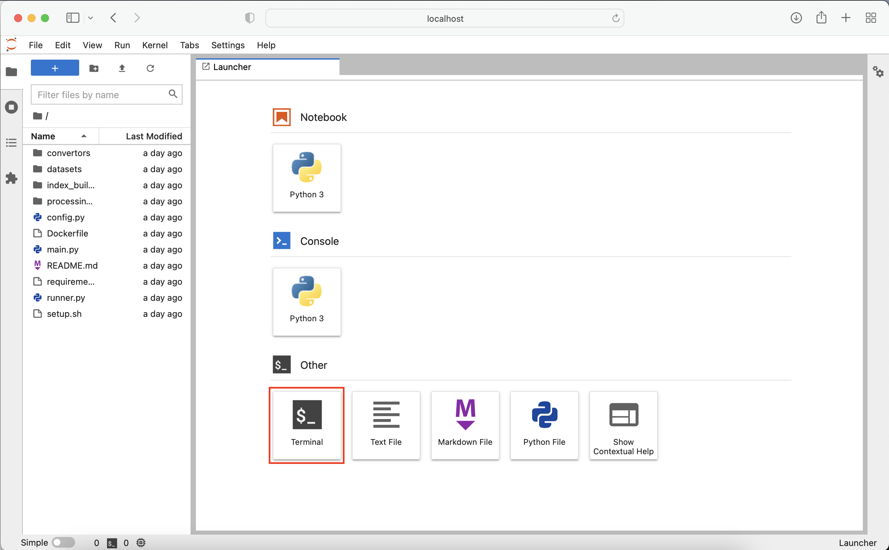
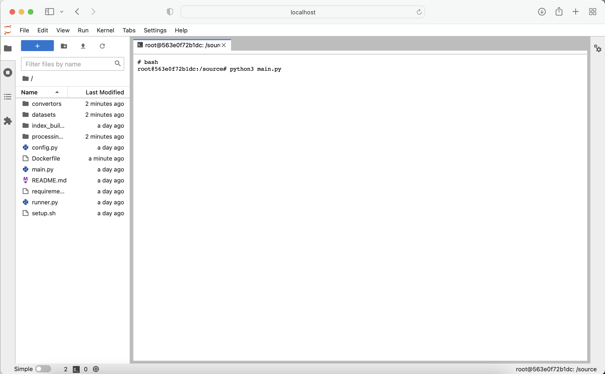

# Task 2 - Generating an index

What we will do:
- Generate a TaskGraph index from downloaded custom dataset

### Walkthrough
By running
```
docker-compose up --build
```
the system builds and a docker container called `taskmap_generation` is created.
This process also automatically downloads two datasets, that we can turn into custom TaskGraph indices.
If you go to `shared/file_system/taskmap_generation/` there should be two sub-folders called `seriouseats/` and `wikihow/`, if you ran `docker-compose` before.

You can configure the index generation and what dataset should be used in `taskmap_generation/config.py`. 
In the config dict, you can define what DataSets should be used by adding or removing datasets in the config dict.
```
config_dict = {
    'file_system_path': get_file_system(),
    'version': "0.3.1",
    'datasets': [wikihow_config, seriouseats_config],
    'IndexBuilder': PyseriniIndexBuilder,
    'generate_dense_index': False,
    'output_dir': "system_index",
}
```

Specifically, for the WikiHow dataset, you can configure what WikiHow categories should be used in your dataset.
Wikihow categories available are the following 12 currently:
- Arts and Entertainment 
- Cars & Other Vehicles
- Computers and Electronics
- Education and Communications
- Family Life
- Finance and Business
- Food and Entertaining
- Health
- Hobbies and Crafts
- Holidays and Traditions
- Home and Garden
- Personal Care and Style
- Pets and Animals
- Philosophy and Religion
- Relationships
- Sports and Fitness
- Travel
- Work World
- Youth

They are listed here: https://www.wikihow.com/Special:CategoryListing

You can define which ones you would like to include in your index here:
```
wikihow_config = {
    'Dataset': WikihowDataset,
    'dataset_kwargs': {
        "categories": ['Home and Garden', 'Hobbies and Crafts'],
        "max_length": 100,
    },
    'dataset_name': 'wikihow',
    'k': 5000,
    'Convertor': WikihowConvertor
}
```

### Running index generation
To run the pipeline, open http://localhost:7500 in your browser. This opens a Jupyter notebook instance, where you can run commands inside the docker container by opening up a terminal.

Open a terminal.

Then run
```
python3 main.py
```

which generates a new index in `shared/file_system/indexes/system_index`.
This new index will be automatically used when you re-run
```
docker-compose up --build
```
to build the system again.