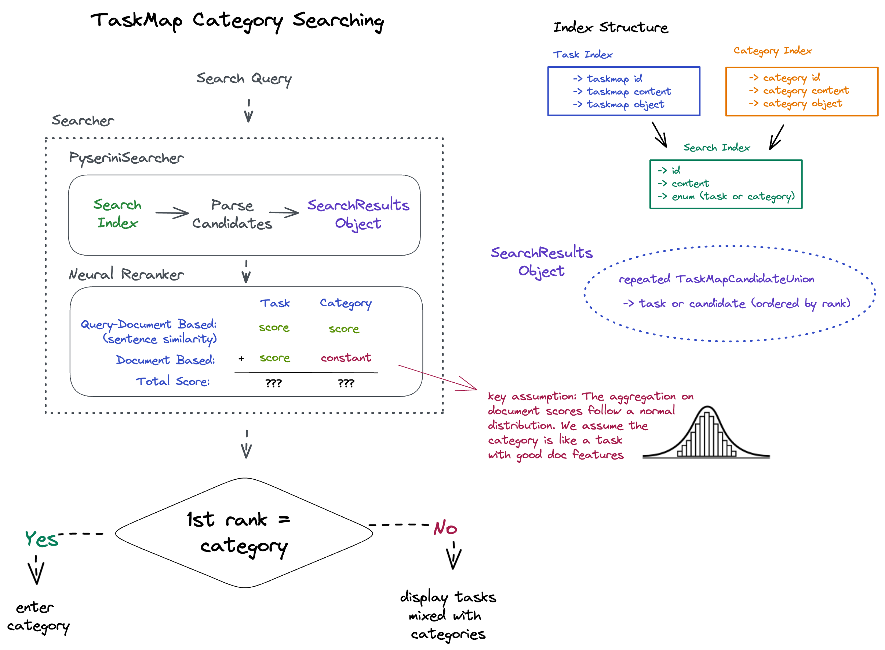

## Category Searcher

This functionality is called by the `Planner` Policy and is used to retrieve possible categories, which might match the user search query.


Queries are formatted as `CategoryQuery`, which consists of the following fields:

```protobuf
message CategoryQuery{
  string text = 1;
  int32 top_k = 2;
}
```

The results are stored as `CategoryDocument` which can be understood by the system and encodes a category.
Each category contains sub_categories, and each sub_category also has taskmap candidates.

Currently, the retrieval is done with a Pyserini index which is built as part of the offline pipeline in `TaxonomyBuildRunner`.

## Incorporating Categories Into Task Search


