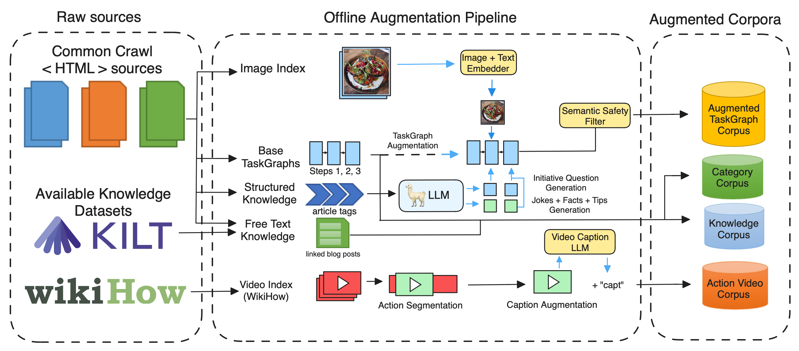

# Offline pipeline
The offline pipeline is used to create artefacts needed for running the default version of OAT.
The offline pipeline was released with OAT v0.2.0.

It consists of the following components:
- [CommonCrawl Fetching](#commoncrawl-fetching)
- [Category Corpus Parsing and Building](#category-corpus-parsing-and-building)
- [TaskGraph Corpus Parsing](#taskgraph-corpus-parsing)
- [TaskGraph Filters](#taskgraph-filters)
- [Knowledge Corpus Parsing and Building](#knowledge-corpus-parsing-and-building)
- [Multimodal Index Building](#multimodal-index-building)
- [TaskGraph Augmenters](#taskgraph-augmenters)
- [TaskGraph Index Building](#taskgraph-index-building)


Source: [GRILLBot-v2 paper](https://assets.amazon.science/f3/75/cbd31079434eaf0c171a1ae0c8a8/grill-tb2-final-2023.pdf)

## 🎬 Running the offline pipeline

To run the offline pipeline, we use a Docker container.
Spin up the offline docker image with the following command:

```bash
docker-compose up --build offline
```

The Docker container then loads all the requirements in `requirements.txt` and runs `main.py`.
Which components of the pipeline are run can be configured in `config.py` by adding a removing components in the `offline_config`.

#### Running with GPU
If you would like to use GPU in any container, you need to add the following to the container in `OAT`'s `docker-compose.yaml` to the `offline` container:

```
deploy:
      resources:
        reservations:
          devices:
            - driver: nvidia
              count: 1
              capabilities: [gpu]
```

This will allow the containers to detect the GPU that the system has.


## ℹ️ Individual components
We will define individual components with their inputs and outputs.
### CommonCrawl Fetching
The class called `CommonCrawl` configures what documents should be parsed.

Input:
- `common_crawl_path`: The path to the csv which contains the [CommonCrawl](https://commoncrawl.org/) offsets that should be crawled.
See [below](#additional-information-about-the-common-crawl-csv) for more information about the csv format.
- `html_proto_path`: Path pointing to where to store the HTML proto documents.
- `domains_to_run`: Which website domains you want to parse. Each website domain needs to have a parser created, e.g. `WikihowParser`.
- `protos_per_file`: (optional) HTML data is saved in batches of `HTMLDocument` protos. This parameter controls how many protos will be saved in each file. The default values is `1000`.
- `thread_pool_size`: (optional) CommonCrawl downloads are performed using a `ThreadPoolExecutor` to retrieve data in parallel. This parameter controls the number of workers in the thread pool. The default value is `5`.
- `retry_count`: (optional) CommonCrawl downloads may fail, e.g. if the servers are under heavy load. By default the downloads will be retried indefinitely until they succeed, corresponding to the `-1` default value for this parameter. If you want to change this behaviour, set the number of retries to zero or a positive integer. The default value is `-1`.
- `retry_delay`: (optional) when downloads are being retried, this parameter gives the delay in seconds between successive attempts. The default values is `0.25`. 

Output:
- `.proto` HTMLDocuments stored in `'offline/protos/htmls'`

#### Additional information about the Common Crawl CSV
Our offline pipeline expects a CSV format with the following columns: 

| url | url_host_registered_domain |fetch_time |fetch_status |warc_filename |warc_record_offset |warc_record_length|warc_segment| crawl |
|-----| ----------- | ----------- | ----------- | ----------- | ----------- |----------- |--------- |--------- |

You can generate a Common Crawl CSV of your liking by following this [guide](https://commoncrawl.org/blog/index-to-warc-files-and-urls-in-columnar-format).
We used the following Athena queries to generate the .csv.
You can choose any crawl of your choice, we used "CC-MAIN-2022-49":

1. Create a database:
```CREATE DATABASE ccindex```
2. Create a table:
```
CREATE EXTERNAL TABLE IF NOT EXISTS ccindex (
  url_surtkey                   STRING,
  url                           STRING,
  url_host_name                 STRING,
  url_host_tld                  STRING,
  url_host_2nd_last_part        STRING,
  url_host_3rd_last_part        STRING,
  url_host_4th_last_part        STRING,
  url_host_5th_last_part        STRING,
  url_host_registry_suffix      STRING,
  url_host_registered_domain    STRING,
  url_host_private_suffix       STRING,
  url_host_private_domain       STRING,
  url_protocol                  STRING,
  url_port                      INT,
  url_path                      STRING,
  url_query                     STRING,
  fetch_time                    TIMESTAMP,
  fetch_status                  SMALLINT,
  content_digest                STRING,
  content_mime_type             STRING,
  content_mime_detected         STRING,
  content_charset               STRING,
  content_languages             STRING,
  warc_filename                 STRING,
  warc_record_offset            INT,
  warc_record_length            INT,
  warc_segment                  STRING)
PARTITIONED BY (
  crawl                         STRING,
  subset                        STRING)
STORED AS parquet
LOCATION 's3://commoncrawl/cc-index/table/cc-main/warc/';
```
3. Make Athena recognise the data partitions on S3: ```MSCK REPAIR TABLE ccindex```
4. Get all URLs:
```SELECT url, 
url_host_registered_domain, 
fetch_time, 
fetch_status, 
warc_filename,
warc_record_offset,
warc_record_length,
warc_segment,
crawl
FROM "ccindex"."ccindex"
WHERE crawl = 'CC-MAIN-2022-49'
  AND subset = 'warc'
  AND url_host_registered_domain IN ('seriouseats.com', 'foodnetwork.com','foodandwine.com','epicurious.com','wikihow.com','wholefoodmarket.com','food52.com')
```
### Category Corpus Parsing and Building
Given all wikihow and seriouseats domain downloaded `HTMLDocument` protos, we attempt to parse them into categories.
This is referred to as `TaxonomyBuildRunner` in the config.
For more details about categories, see the specific [README](./../functionalities/category_searcher/README.md).

Input:
- `html_proto_path`: Where the HTML proto documents are stored.
- `tasks_that_require_scraping_path`: Path to csv where tasks that are contained in categories are saved.
- `knowledge_proto_path`: Path where the Category Protos should be stored.
- `parsers`: which parsers should be used (determines which domain is parsable)
- `objects_index_dir`: where the Category Index should be outputted to
- `index_builder`: how we should build the index

Output: 
- Category Index in the path defined in `objects_index_dir` (currently in `'offline/category_index/objects_idx'`)

### TaskGraph Corpus Parsing
This part of the pipeline converts individual `HTMLDocument` into `TaskMap` protos.
This attempts to parse everything contained in the html into a system digestible task format.
This is referred to as `TaskgraphConstruction` in the config file.
More documentation for individual parsers can be found in the specific [README](./document_parsers/README.md).

Input:
- `html_proto_path`: Where the HTML proto documents are stored.
- `taskgraph_proto_path`: Path where the newly created protos should be stored
- `parsers`: which parsers should be used to attempt converting the html into task data. See [README](./document_parsers/README.md).
- `parse_domains`: which website domains we should attempt parsing (leave empty if you want to parse all)

Output:
- `.proto` `TaskMap` documents stored in `'offline/protos/taskgraphs'`

### TaskGraph Filters

This is used to filter out unusable tasks.
We have different filters available, including dangerous, single step and title duplicates.
The filters should preferably be run after `TaskGraph Construction`.
However, the filter components can be integrated after task augmentations.
The filtering statistics are gathered in the folder `filesystem/offline/stats/filtering`.

Input:
- `path_in`: Which TaskGraphs should be filtered. Should be pointing to a folder with `TaskMap` protos.
- `path_out`: Path where the filtered TaskGraphs should be copied to.
- `task_filters`: Which filters should be used. See [below](#available-filters).

Output:
- Filtered TaskGraphs stored in `path_out` (currently in `'offline/protos/taskgraphs_filtered'`)

#### Available Filters
##### Composed Filter 
Collects all used filters and gathers filter statistics. Each filter inherits from the `AbstractTaskFilter`.

###### Dangerous Filter
The dangerous filter step filters out TaskGraphs based on the Dangerous Classifier. The main purpose of this step is to remove any task which could be dangerous e.g. "How to start a fire indoors?". Two paths are required for running the step: the filepath to the folder where the TaskGraphs are located, and the filepath indicating the folder where the filtered taskgraphs are saved. The filter can be run on any type of TaskGraph irrespective of the augmentations.

##### SingleStepFilter
This filter is responsible for filtering tasks which has none or only one step.

##### Filter Task Title Duplicates
This filter is responsible filtering out tasks with the same title.

### Knowledge Corpus Parsing and Building
This converts individual `HTMLDocument` into `KnowledgeDocument` protos.
This enables parsing content that would otherwise be discarded, like linked blog posts, additional tips and FAQs.
Parsed `KnowledgeDocument` protos are then indexed into an index.
For more details, see the specific [README](./knowledge_corpus/README.md).

Input: 
- `html_proto_path`: Where the HTML proto documents are stored.
- `parsers`: which parsers should be used to attempt converting the html into knowledge protos. See [README](./knowledge_corpus/README.md).
- `index_builder`: how we should build the index
- `knowledge_proto_path`: Path where the Knowledge Protos should be stored.
- `knowledge_index_search_dir`: where the Knowledge Index indexed on the context should be stored
- `knowledge_index_objects_dir`: where the knowledge index storing the knowledge documents for lookup should be stored

Output:
- knowledge search index
- knowledge lookup index

## Multimodal Index Building

We have an audio index builder (`AudioIndexBuilder`) and a video index builder (`VideoIndexBuilder`).
The audio index consists of the transcripts of the videos in the video index.
This is used in the `audio_video_step_alignment` in the TaskGraph [augmenters](#taskgraph-augmenters).
The video index is used for the How-To-Video search algorithm introduced in the [GRILLBot-v1](https://assets.amazon.science/7c/99/e7a8d35a43c88cf0e8ad59b92dfc/grillbot-a-flexible-conversational-agent-for-solving-complex-real-world-tasks.pdf).

The video index is built from the transcripts and the metadata of the videos.

Output:
- audio index ("audio_index") and video index ("video_index-simple")

### TaskGraph Augmenters
Augmenters are used to take existing TaskGraphs and enrich them with additional information.
In the config, this is referred to as the `AugmentationsIterator`.

In the default version, we currently use the following augmenters:
- RequirementsAugmenter
- ImageThumbnailAugmenter
- StepImageAugmenter
- StepSplittingAugmenter
- JokeAugmenter
- FactAugmenter

More information on each can be found in the specific [README](./augmenters/README.md).

Currently, all augmenters can be run by setting the following in config

```python
{
    'enable': True,
    'step': 'Taskgraph Augmentations',
    'class': AugmentationsIterator,
    'kwargs': {
        'taskgraph_proto_path': os.path.join(get_file_system(), 'offline/protos/taskgraphs/summary'),
        'augmented_taskgraph_proto_path': os.path.join(get_file_system(), 'offline/protos/augmented-taskgraphs/summary'),
        'augmenters': [RequirementsAugmenter, StepTextAugmenter, ImageAugmenter, JokeAugmenter,
                       StepSplittingAugmenter]
    }
}
```
More information how to implement an Augmenter and different abstract classes available can be found
[here](./augmenters/README.md).

Input:
- `taskgraph_proto_path`: where the TaskGraphs (`TaskMap` protos) that should be augmented live
- `augmented_taskgraph_proto_path`: where the newly augmented TaskGraphs should be written out to
- `augmenters`: which augmenters should be used. See the [README](./augmenters/README.md) for
more information about which augmenters we implemented.
- `augment_domains`: specify which domains should be augmented.
If left empty no domains will be filtered out.

Output:
- augmented TaskGraphs. Stored in the folder defined by `augmented_taskgraph_proto_path`

### TaskGraph Index Building
Used to build the indices needed for the TaskGraph search functionality in functionalities.
Our current index is a hybrid of categories and normal search results, therefore the category documents
specified in `category_proto_path` are indexed too.


Input:
- `rebuild_objects_only`: (bool) if set True, only the lookup index is built
- `taskgraph_proto_path`: where the TaskGraphs (`TaskMap` protos) that should be indexed live
- `taskgraph_proto_path_flattened`: ? LEGACY, for when taskgraph domains where saved in different folders
- `category_proto_path`: path where the category protos that should be indexed too live
- `index_search_dir_sparse`: where the sparse TaskGraph Index indexed should be stored
- `index_search_dir_dense`: where the dense TaskGraph Index indexed should be stored
- `index_objects_dir`: where the lookup TaskGraph Index should be stored

Output:
- dense TaskGraph index
- sparse TaskGraph index
- lookup TaskGraph index (containing the whole taskgraph object)
