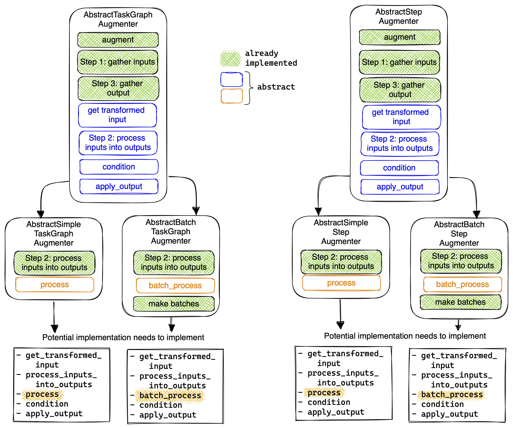
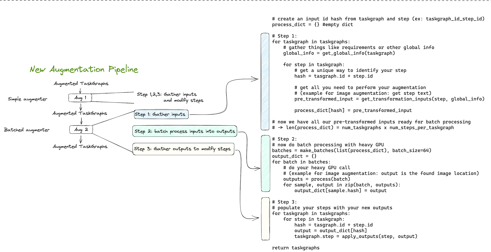

# Augmenters

Contents:
- [Creating a new augmenter](#creating-a-new-augmenter)
- [Currently implemented augmenters](#currently-implemented-augmenters)
  - [Simple Step splitter](#simple-step-splitter)
  - [Image augmenter](#image-augmenter)
  - [Summary augmenter](#summary-augmenter) ** *depreciated* **
  - [Joke augmenter](#joke-augmenter)
  - [Audio video step alignment (video augmenter)](#audio-video-step-alignment)
    - [How the video augmenter works](#how-the-video-augmenter-works)
    - [How whisper works](#how-whisper-works)
  
## Creating a new augmenter

To help adding new augmenters, we created the following abstract classes:
- `AbstractTaskGraphAugmenter` -> `AbstractSimpleTaskGraphAugmenter` & `AbstractBatchTaskGraphAugmenter`
- `AbstractStepAugmenter` -> `AbstractSimpleStepAugmenter` & `AbstractBatchStepAugmenter`

In the below diagram, green functions are already implemented by the abstract class.
Blue and orange functions have to be implemented by classes that implement the abstract class.
This means that a class that implements for example `AbstractSimpleStepAugmenter`, like the `RequirementsAugmenter`,
needs to implement `get_transformed_input`, `process_inputs_into_outputs`, `process`, `condition` and `apply_output`.


More explanation of what each function does that you need to implement when you implement the `AbstractTaskGraphAugmenter` family:

- `condition`: takes in a `TaskMap` and returns `True` if the augmentation should be run for this `TaskMap`, else returns `False`
- `get_transformed_input`: takes in a `TaskMap`, and adds whatever pre_transformation we need in order to allow the augmentation to happen
- `process`: runs the augmentation on a single `TaskMap`, returned by the processing.
It then applies the processed output to return an adjusted `TaskMap` version.
- `batch_process`: runs the augmentation on a batch of `TaskMap`'s, returns a list of `TaskMap`'s, utlising GPU
- `apply_output`: takes in the original `TaskMap` and the processed_output by TaskMap:

More explanation of what each function does that you need to implement when you implement the `AbstractStepAugmenter` family:

- `condition`: takes in a `ExecutionStep` and returns `True` if the augmentation should be run for this `TaskMap`, else returns `False`
- `get_transformed_input`: takes in a `TaskMap`, and returns whatever global information we need in order to perform the augmentation
- `process`: runs the augmentation on a single `ExecutionStep`, returns a `ExecutionStep`
- `batch_process`: runs the augmentation on a batch of `ExecutionStep`'s, returns a list of `ExecutionStep`'s, utlising GPU
- `apply_output`: takes in the original `ExecutionStep` and the `processed_output` returned by the processing.
It then applies the processed output to return an adjusted `ExecutionStep`

This allows easier implementation of the behaviour for specific augmenter implementations.
We use a "Batch" augmenter if the augmenter requires GPU usage.
Some pseudo code of the pipeline can be found below:



## Currently implemented augmenters

### Simple Step splitter
Using ntlk, we split the steps based on detected cooking verbs, defined in `cooking_verbs.txt`. 
We then merge steps together if they are too short.
This allows more consise steps whilst removing some of the fluff.

### Image augmenter
Image augmenter finds and add an image to every step in TaskMap.

First, check whether the TaskMap already has a thumbnail. If not, add image from image index, which is the most similar to the TaskMap title.
Next, if the given step already has an image stored in "image_list", do not search for more images. This means that the image was scraped together with the task, and therefore more similar image can not be found. If there is no image in the "image list", search and add an image from the image index, which is the most similar to the TaskMap title and step text.

### Summary augmenter
DEPRECATED - Use step splitting augmenter in place of this.

Task step lengths with a length over 700 characters (50-60 seconds speaking time) are summarised using flanT5 (zero shot).
The summary is added to step.response.description.

### Joke augmenter
Joke augmenter adds jokes to a step.
For each sentence in step text, it checks the keywords and retrieves any jokes associated with these keywords from the joke list.
Then, it creates a new ExtraInfo node for each joke and adds it to the extra_information attribute of the step.

There is an extra configuration that can be used to query GPT-3 to generate new jokes, which we have currently disabled. 
In that case, the Joke generator (in offline/extra_info) is used to store a newly generated jokes.

### Audio video step alignment
LONG EXPLANATION.
This augmenter has the goal of linking a video snippet to a task step.
When downloading the video collection, we used a model called Whisper to transcribe each downloaded video.


#### How Whisper works:
The way that [Whisper](https://huggingface.co/openai/whisper-base.en) works is that takes a video, transcribes it and splits it into parts, 
which contains a start and end time for the snippet and the snippet transcript. The parts could for example look like this:

Recipe URL: https://www.allrecipes.com/recipe/20338/strawberry-pretzel-salad/

Video URL: https://playback.video.meredithcorp.io/1033249144001/1882582232001.m3u8

```python
[' The Tilda, the all recipes member who submitted this strawberry pretzel salad recipe, describes',
 " it as a dessert that's not too sweet or too salty adding.",
 " It's really pretty when you make it in a clear oven proof dish.",
 ' Another member comments, so delicious!',
 " First time having it and I can't wait to try it again.",
 ' This recipe by thawing an 8 ounce container of frozen whipped topping.',
 ' Then, preheat the oven to 400 degrees.',
 ' Place about 4 cups of small pretzels in a gallon sized, resealable bag.',
 ' Seal the bag, squeezing out as much air as possible.',
 ' Use a rolling pin to smash the pretzels into crumbs.',
 " You'll need 2 cups of crumbs for the recipe.",
 ' Transfer the 2 cups of pretzel crumbs to a medium bowl.',
 ' Pour 3-4 cups of melted butter over the pretzels.',
 ' And 3 tablespoons of sugar.',
 ' And stir to blend.',
 ' Place the mixture into the bottom of a 9x13 inch baking dish.',
 ' And bake the crumbs in the preheated oven for 8-10 minutes or until the crust is set.',
 ' Remove the dish from the oven and set it on a wire rack to cool.',
 " Let's make a filling now.",
 ' Put an 8 ounce package of softened cream cheese into a large bowl.',
 ' Add a cup of sugar.',
 " And beat with an electric mixer on medium speed until it's well blended.",
 ' Scrape down the sides of the bowl when necessary.',
 ' And 8 ounces of thawed whipped topping and fold it into the cheese and sugar.',
 ' Spread the filling evenly over the cooled pretzel crust.',
 ' And all recipes member says to make sure that you spread the cream cheese layer all the',
 " way to the edges of the pan so the jello layers can't seep under the cream cheese and make",
 ' the crust soggy.',
 ' Several members suggest chilling the cream cheese layer before topping it with the jello.',
 ' Now for the topping.',
 ' Look, 2-3 ounce packages of strawberry flavored gelatin into a medium bowl.',
 ' Pour in 2 cups of boiling water, stirring until the gelatin is dissolved.',
 ' Stir in 20 ounces of frozen strawberries.',
 " Allow the mixture to set until it's the consistency of egg whites.",
 ' Boon the topping over the cream cheese filling and spread it evenly.',
 ' Clean the edges if necessary and cover with plastic wrap.',
 ' Refrigerate until the gelatin topping is completely set.',
 ' Let the strawberry pretzel salad into squares and serve.']
```

#### How the video augmenter works:
This augmenter currently consists of the following steps:
1. **Check for already linked video**. Given a step (represented as an `OutputInteraction`), check if the step already has a video linked.
   If yes, then go to Step 3. Else, go to Step 2.
2. **Find the best matching video**. For a given step text, find the best matching video in the video corpus. 
   This is done using a video index, which we have built from the metadata of the video collection on S3.
   The video searcher can be queried in the following way:
   
    ```python
    video_result: VideoDocument = self.searcher.search_video(task_step_text)
    ```
3. **Retrieve the Whisper transcript for the best matching video**. For the best video match we want to retrieve the whisper captions.
   The whisper captions have been pre-generated for the entire S3 video collection.
   We have built an index containing the captions in an earlier step of the offline pipeline, which we can time-efficiently query (no GPU needed).
   We retrieve the captions with the `retrieve_whisper_captions()` function, which accesses the audio index,
   here called `transcript_searcher`.
   
    ```python
    video_steps_captions = self.retrieve_whisper_captions(video_result)
    ```
   
   However, if the video id is not found in the transcript index (because it has been for example added later), 
   we run Whisper to transcribe the video. In this case, `retrieve_whisper_captions` calls `__whisper_transcribe_video()`,
   which does live transcribing of the video.
   Whisper requires the video file to be converted to an audio file, which is done with `ffmpeg`.
   If this Whisper live transcription call would happen, this would benefit of having GPU access.
   
   HOWEVER THE LIVE TRANSCRIBING SHOULD CURRENTLY NOT HAPPEN.
   Any video we currently match should be also transcribed, aka in the audio index.
   This means that this step should not require GPU for now.
   
4. **Find the best matching transcript snippet**. Next up, if we managed to retrieve the whisper captions for the video,
    we run the computation heavy step of the augmentation.
   Here, we take the segments of the video transcript that Whisper generated.
   We use a [sentence transformer model](https://huggingface.co/sentence-transformers/all-MiniLM-L6-v2)
   to find the most similar text snippet of the video transcript to the step text.
   This step would benefit from GPU.
   We optimised this for batch processing, but a simplified version of this can be seen below:
   
    ```python
    video_captions_embeddings = self.embedder.encode([v['text'] for v in video_steps], convert_to_tensor=True)
    query_embedding = self.embedder.encode(task_step_text, convert_to_tensor=True)
    similarity_scores = util.cos_sim(query_embedding, video_captions_embeddings)[0]
    ```
5. **Link the video snippet to the agent response**.
    If the `confidence < 0.5`, we change the video field in the step's `OutputInteraction`.
   If there was already a step specific video, we only update the timestamps.
   Else (which is usually the case at the moment, since we have no step specific videos from another source),
   we add a new `Video` proto message containing the video details.
   
    ```python
        video: Video = Video()
        video.title = video_result.title
        video.doc_id = video_result.doc_id
        video.hosted_mp4 = video_result.hosted_mp4
        video.start_time = linked_video['start']
        video.end_time = linked_video['end']
    ```

Then we return add the video to the step's `ScreenInteraction` and return the step
with the linked video (if the confidence is high enough).
