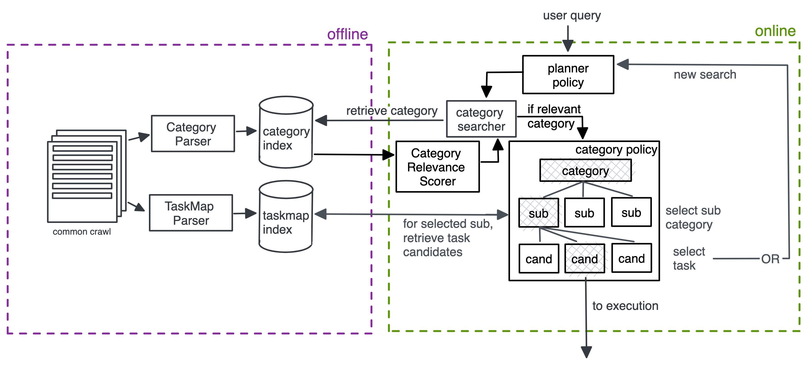

## Category Corpus & Index Building

### The Idea behind categories
The idea is that we can use categories to help users (and ourselves!) to find a better matching search result for user. 
This will allow narrowing down tasks to show, e.g. when the user searches for ["Crafts"](https://www.wikihow.com/Category:Crafts) or ["Home improvement"](https://www.wikihow.com/Category:Home-Improvements), 
since the retrieved task titles do not explicitly have to mention the user search query.
We will hopefully show more diverse search results that are more thematically relevant.

*What is a category? Examples:*
- Wikihow: e.g. https://www.wikihow.com/Category:Crafts
- Seriouseats: e.g. https://www.seriouseats.com/bean-recipes-5117750

For example, when someone searches for "Beans", it is quite difficult to find whatever the user had in mind.
By scraping the seriouseats overview pages, we can collect the tags (yellow boxes) to retrieve the most mentioned categories.
This will help understand cooking taxonomy.


We can then use this information to suggest the user e.g. the subcategories: **Sides**, **Mains** and **Black Beans**.
This will hopefully allow narrowing down what the user wants.
If the user selects for example **Sides**, we can suggest "Mexican Refried Beans", "Bean Salads" or "Hoppin' John".

For **seriouseats**, here are some of the available tags:


For **wikihow**, some examples include:
- e.g. crafts (category) -> animal crafts (sub category)-> origami (sub category) -> https://www.wikihow.com/Fold-a-Paper-Box (task) / https://www.wikihow.com/Make-Lucky-Paper-Stars (task) / https://www.wikihow.com/Make-a-Kusudama-Ball (task) 
- e.g. crafts (category)-> needlework (sub category) -> How to slip stitch (task)/  how to do needlepoint (task) and how to sew lace (task)

### Architecture


This offline functionality contains the LHS of the diagram and includes the parsing and index building from common crawl.

#### Parsing
As part of the offline pipeline, we have parsers that can detect
`Seriouseats` and `Wikihow` categories.
Each parsers abstract behaviour is defined in `AbstractTaxonomyBuilder`.

The parsers are called by `KnowledgeConstruction` in `index_builders/`,
which allow writing out the `CategoryDocument` into the file_system.
The behaviour of the `index_builders/` functionality is 
described the same folder's [README](../index_builders/README.md).

#### Description Generation (*currently disabled*!)
Idea: Each category should have a description that introduces the category. If a description is missing, they are generated by OpenAI.
Execution: The descriptions are generated with `generate_description()` in `AbstractTaxonomyBuilder`. The descriptions are created based 
on the name of the category. The prompt used for generating descriptions is in the same method.

To generate descriptions, the `openai.api_key` field in `AbstractTaxonomyBuilder` needs to be populated. *To enable prompts, the 
following lines need to be commented out in `AbstractTaxonomyBuilder`:*
```
# if category_doc and category_doc.description == "": 
#     category_doc.description = self.generate_description(category_doc.title)
```
The generated descriptions are stored in json format at `shared/file_system/offline/openai_responses/category_responses.txt`

#### Index generation

Using the `CategoryIndexBuilder`, we then retrieve those written out files
and convert them into the jsonlines format required for Pyserini indexing.
We finally build an `objects_index` which can be used by the 
`CategorySearcher` in `functionalities/` to retrieve categories in the online system.

#### Running all
The whole process from parsing to indexing is run by the `TaxonomyBuildRunner`,
which defines the above described behaviour. 
Specific paths and which index builder should be used can be defined in the `offline/config.py`.
